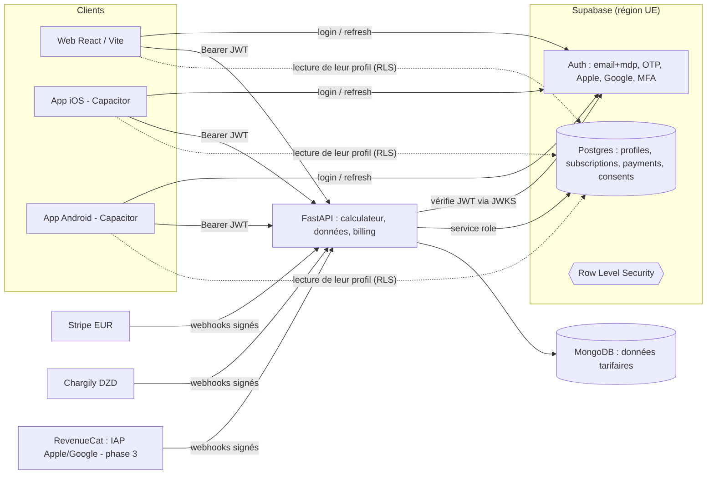

# Audit — Inscription, paiement et données personnelles
## Plan d'amélioration, étude de faisabilité Supabase et prérequis iOS / Android

*Date : 25/09/2026 — périmètre : `backend/routes/user_auth.py`, `backend/services/user_auth_service.py`, `backend/auth.py`, `backend/routes/billing.py`, `backend/services/stripe_service.py`, `backend/services/chargily_service.py`, `backend/services/geo_service.py`, `backend/pricing.py`, `backend/entitlements.py`, `backend/entitlement_guard.py`, `backend/server.py` (index, amorçage admin), middlewares CSRF / rate‑limit, `frontend/src/context/AuthContext.jsx`, `frontend/public/pricing.html`, `frontend/public/manifest.json`.*

> Les points de droit (RGPD, loi algérienne 18‑07, règles App Store / Google Play) sont résumés à titre d'orientation technique et doivent être validés par un juriste avant mise en production. Les tarifs et conditions des services tiers (Supabase, RevenueCat, Apple, Google) cités sont à revérifier au moment de la souscription.

---

## 1. Synthèse

| Domaine | État | Verdict |
|---|---|---|
| Paiement web (Stripe EUR / Chargily DZD) | Bien conçu : prix côté serveur, Checkout hébergé, webhooks signés et idempotents, accès accordé uniquement par webhook | **Solide**, quelques correctifs de cohérence |
| Inscription / connexion | Fonctionnel mais minimal : pas de vérification d'email, pas de réinitialisation de mot de passe, pas de révocation de session, pas de MFA | **Insuffisant pour une production grand public** |
| Données personnelles | IP d'inscription et de paiement conservées sans durée, pas de consentement tracé, pas de suppression ni d'export de compte | **Non conforme** (RGPD art. 5, 7, 15, 17, 20) |
| Prêt pour iOS / Android | Session par cookie `SameSite=None; Partitioned` réglée pour l'iframe Emergent, manifeste PWA invalide, aucune suppression de compte, stratégie d'achat in‑app absente | **Bloquant pour la publication** |

**Recommandation principale :** confier l'identité (inscription, connexion, sessions, vérification d'email, MFA, suppression de compte) à **Supabase Auth**, et regrouper profils + abonnements + journal de paiements dans le **Postgres Supabase** avec Row Level Security. FastAPI reste le backend métier et vérifie simplement les jetons Supabase. Stripe et Chargily restent inchangés côté web. C'est faisable en **3 à 5 semaines** sans casser les comptes existants (import des hachages bcrypt).

---

## 2. Audit de l'existant

### 2.1 Ce qui est bien fait (à conserver)

- **Autorité serveur sur les montants** : grille unique `pricing.py`, `price_id` Stripe lus dans l'environnement, le navigateur n'envoie qu'un couple `(plan, cycle)` validé par `Literal` (`billing.py:78-81`).
- **Aucune donnée de carte ne transite** par le backend (Stripe Checkout / Chargily hébergés) → périmètre PCI‑DSS minimal (SAQ A).
- **Accès accordé uniquement par webhook signé**, jamais sur l'URL de succès (`billing.py`, docstring).
- **Idempotence des webhooks** : index unique `payment_events.event_id` + libération de la réservation en cas d'échec (`_claim_event` / `_release_event`).
- **Chargily** : retries uniquement sur échec pré‑envoi (pas de double débit), HMAC vérifié en temps constant.
- **Résolution des droits fail‑closed** (`entitlements.py`) : statut inactif, date invalide ou période expirée → `free`.
- **Hachage bcrypt** hors boucle événementielle, contrôle des 72 octets, cookie `httpOnly`, CSRF double‑submit, rate‑limit dédié à `/auth/login` et `/auth/register`, CORS en liste blanche exacte.
- **Routage imposé par le pays d'inscription** : Algérie → Chargily, étranger → Stripe, sans choix de l'utilisateur ; paiement refusé si le pays est indéterminable ; dérogation posée uniquement par le support.

### 2.2 Constats — Inscription et sessions

| # | Gravité | Constat | Référence |
|---|---|---|---|
| A1 | **Haute** | **Aucune vérification d'email.** N'importe qui peut créer un compte au nom d'une adresse qui ne lui appartient pas ; le vrai titulaire reçoit ensuite `409` et ne peut plus s'inscrire. Les emails transactionnels de facturation partent vers des adresses non prouvées. | `user_auth.py:163-215` |
| A2 | **Haute** | **Pas de réinitialisation de mot de passe** ni de changement de mot de passe. Un mot de passe oublié = compte perdu (ou intervention manuelle en base). | absent du routeur `/auth` |
| A3 | **Haute** | **Jeton JWT de 7 jours sans révocation.** `logout` ne fait qu'effacer le cookie : un jeton volé reste valide 7 jours. Pas de jeton de rafraîchissement, pas de « déconnecter tous les appareils ». | `user_auth_service.py:16`, `user_auth.py:292` |
| A4 | Moyenne | **Verrouillage indexé sur l'email seul** : 5 essais faux suffisent à bloquer n'importe quel compte 15 min, en boucle (déni de service ciblé). | `user_auth.py:247` |
| A5 | Moyenne | **Énumération de comptes** : `/auth/register` répond « Un compte existe déjà avec cet email ». | `user_auth.py:173` |
| A6 | Moyenne | **Compte admin sans MFA**, dans la même collection que les utilisateurs, mot de passe resynchronisé depuis `.env` à chaque démarrage. | `server.py:313-346` |
| A7 | Moyenne | **Aucun consentement enregistré** (version des CGU / politique de confidentialité acceptée, date, opt‑in marketing). | `RegisterPayload` |
| A8 | Faible | Pas de connexion sociale (Google / Apple) ni de lien magique — frein à la conversion mobile. | — |

### 2.3 Constats — Paiement

| # | Gravité | Constat | Référence |
|---|---|---|---|
| P1 | **Haute** | **La formule est déduite des `metadata` et non du prix.** Sur `customer.subscription.updated`, le tier vient de `metadata.plan`, figé à la création. Si le Customer Portal autorise le changement de formule (configuration du dashboard Stripe, non versionnée dans le dépôt), un client passé de Pro à Starter conserve l'accès Pro — et inversement. Il faut dériver le plan du `price.id` de l'item. | `billing.py:543-551` |
| P2 | **Haute (à vérifier)** | **`current_period_end` au niveau de l'abonnement** : depuis la version d'API Stripe `2025-03-31.basil`, ce champ est porté par les *subscription items*. Si l'endpoint webhook est configuré sur une version récente (le SDK installé est `stripe==15.1.0`), `_period_end()` renvoie `None` et **écrase** `subscription_current_end`. Vérifier la version d'API de l'endpoint dans le dashboard ; lire `items.data[0].current_period_end` en repli. | `billing.py:382-384` |
| P3 | Moyenne | **Renouvellement Chargily pénalisant** : `period_end = now + 30/365 j`. Un client qui renouvelle 10 jours avant l'échéance perd 10 jours payés. Il faut partir de `max(now, subscription_current_end)`. Aucun rappel avant expiration non plus (pas de prélèvement récurrent côté Chargily) → attrition. | `billing.py:643-644` |
| P4 | Moyenne | **État d'abonnement « à plat » sur le document utilisateur** : pas d'historique des paiements, factures, remboursements ni changements de formule. Difficile pour la comptabilité, les litiges et l'audit. `payment_events` ne stocke que l'id et le type. | `billing.py` |
| P5 | Faible | Webhook Chargily : le montant payé n'est pas recoupé avec la grille (`pricing.dzd_amount`). Risque faible (checkout créé côté serveur) mais contrôle de défense en profondeur peu coûteux. | `billing.py:636-655` |
| P6 | Faible | `checkout.session.completed` ne pose pas `subscription_current_end` ; on dépend de l'arrivée ultérieure de `subscription.updated`. | `billing.py:516-531` |
| P7 | Faible | Pas de collecte d'identifiant fiscal (TVA / NIF) ni de TVA automatique pour les clients B2B UE (`tax_id_collection`, Stripe Tax). | `stripe_service.py:94` |

### 2.4 Constats — Données personnelles

| # | Gravité | Constat | Référence |
|---|---|---|---|
| D1 | **Haute** | **Pas de suppression de compte ni d'export des données** (RGPD art. 17 et 20). **Bloquant App Store** (règle 5.1.1(v) : suppression du compte depuis l'app) et **Google Play** (suppression dans l'app + lien web). | absent |
| D2 | **Haute** | **Adresses IP conservées sans durée limite** : `users.signup_ip`, `payment_attempts.ip`/`signup_ip`, `login_attempts`. Le code le reconnaît (« prévoir une purge périodique ») mais aucune purge ni index TTL n'existe. Contraire au principe de limitation de conservation (RGPD art. 5.1.e). | `user_auth.py:192`, `billing.py:285`, `server.py:305` |
| D3 | Moyenne | **Données personnelles dispersées** : MongoDB (users, payment_attempts, login_attempts, contact), Stripe, Chargily, fournisseur d'email. Pas de registre des traitements ni de cartographie → réponse à une demande d'accès difficile. | — |
| D4 | Moyenne | **Localisation de l'hébergement MongoDB non documentée** (déploiement Emergent/Replit). Impossible de répondre à « où sont mes données ? », exigé par le RGPD (transferts hors UE) et par la loi algérienne 18‑07 (transferts à l'étranger soumis à l'autorisation de l'ANPDP). | `server.py:114` |
| D5 | Faible | Collecte correcte au regard de la minimisation (nom, email, mot de passe) — à conserver. | — |

### 2.5 Constats — Prérequis mobile

| # | Gravité | Constat |
|---|---|---|
| M1 | **Bloquante** | **Session par cookie inadaptée au natif.** Dans une app Capacitor (origine `capacitor://localhost` / `https://localhost`), les appels vers l'API sont cross‑site : WKWebView (ITP) bloque les cookies tiers par défaut, et le CSRF double‑submit repose lui aussi sur un cookie. `get_current_user` accepte déjà `Authorization: Bearer`, mais `/auth/login` ne renvoie pas le jeton dans la réponse. Il faut des jetons d'accès courts + jeton de rafraîchissement stockés dans le Keychain / Keystore. |
| M2 | **Bloquante** | **Aucune suppression de compte** (voir D1). |
| M3 | **Bloquante** | **Stratégie d'achat in‑app absente** : Apple (3.1.1) et Google Play (Payments policy) exigent en principe leur système de facturation pour les abonnements numériques vendus dans l'app. Chargily / CIB / Edahabia ne peuvent pas y être utilisés. Voir §5. |
| M4 | Haute | **`frontend/public/manifest.json` est un JSON invalide** (clés dupliquées, virgule manquante ligne 27) et le dossier `public/icons/` référencé n'existe pas → l'installation PWA ne fonctionne pas, et une Trusted Web Activity (Android) ne peut pas être générée. |
| M5 | Moyenne | Redirections de fin de paiement vers `pricing.html?checkout=…` : dans une app, il faut des *Universal Links* (iOS) / *App Links* (Android) pour revenir dans l'app. |
| M6 | Moyenne | Pas de « Sign in with Apple » : obligatoire sur iOS dès qu'une connexion sociale tierce (Google…) est proposée (règle 4.8). |

---

## 3. Faisabilité de la gestion des inscriptions par Supabase

### 3.1 Architecture cible (option recommandée : Supabase Auth + Postgres, FastAPI conservé)



- **Supabase Auth** gère : inscription, confirmation d'email, mot de passe oublié, lien magique / OTP, OAuth Google et Apple (y compris le flux natif par `id_token`), MFA TOTP, jetons d'accès courts + rafraîchissement avec rotation, révocation de sessions, CAPTCHA (hCaptcha / Turnstile), limites de débit.
- **FastAPI** remplace `decode_access_token` par une vérification du JWT Supabase (clés asymétriques exposées en JWKS, ou secret HS256 du projet) ; `entitlement_guard` lit l'abonnement dans Postgres. Les routes `/api/auth/register|login|logout` deviennent inutiles.
- **Postgres Supabase** : le projet utilise déjà Postgres (`psycopg2`, `routes/postgres_tariffs.py`) — pas de nouvelle technologie pour l'équipe.
- **MongoDB** reste pour les données tarifaires ; seules les données de comptes et de facturation migrent.

Schéma minimal :

```sql
create table public.profiles (
  id uuid primary key references auth.users(id) on delete cascade,
  name text not null,
  role text not null default 'user',
  signup_country char(2),
  billing_stripe_exemption boolean not null default false,
  created_at timestamptz not null default now()
);

create table public.subscriptions (
  id bigserial primary key,
  user_id uuid not null references auth.users(id) on delete cascade,
  provider text not null check (provider in ('stripe','chargily','apple','google')),
  plan text not null check (plan in ('starter','pro','business')),
  cycle text,
  status text not null,
  current_period_end timestamptz,
  provider_ref text,                -- subscription_id Stripe, checkout Chargily, transaction IAP
  updated_at timestamptz not null default now()
);

create table public.payments (      -- historique : paiements, échecs, remboursements
  id bigserial primary key,
  user_id uuid references auth.users(id) on delete set null,  -- conservé anonymisé (obligations comptables)
  provider text not null, provider_event_id text unique not null,
  type text not null, amount_minor bigint, currency char(3),
  created_at timestamptz not null default now()
);

create table public.consents (
  user_id uuid references auth.users(id) on delete cascade,
  document text not null, version text not null,      -- 'cgu', 'privacy', 'marketing'
  granted boolean not null, at timestamptz not null default now()
);

alter table public.profiles      enable row level security;
alter table public.subscriptions enable row level security;
create policy "own profile"      on public.profiles      for select using (auth.uid() = id);
create policy "own subscription" on public.subscriptions for select using (auth.uid() = user_id);
-- écritures : uniquement via le backend (service role) ; aucune policy insert/update côté client.
```

### 3.2 Avantages

**Gestion des données personnelles (point clé)**

| Besoin | Aujourd'hui | Avec Supabase |
|---|---|---|
| Savoir où sont les données | Hébergement MongoDB non documenté | Région choisie explicitement (UE : Francfort ou Paris) ; DPA (accord de sous‑traitance) et rapport SOC 2 Type II disponibles |
| Droit à l'effacement (art. 17) + exigence Apple/Google | À développer entièrement | `auth.admin.deleteUser()` + `on delete cascade` : une seule opération efface profil, abonnements, consentements ; paiements conservés anonymisés pour la comptabilité |
| Droit d'accès / portabilité (art. 15, 20) | À développer | Une requête SQL par utilisateur sur un schéma unique → export JSON |
| Limitation de conservation (art. 5.1.e) | Aucune purge | `pg_cron` : purge planifiée des IP > 90 jours, des comptes non confirmés > 30 jours |
| Cloisonnement des accès | Tout le backend lit tout | RLS : un client ne lit que sa propre ligne, même en cas de bug dans une route |
| Consentement (art. 7) | Non tracé | Table `consents` versionnée, horodatée |
| Sécurité des comptes | Pas de vérification email, pas de MFA, pas de révocation | Confirmation d'email, MFA TOTP, révocation des sessions, journal d'audit Auth |
| Mots de passe | bcrypt maison | bcrypt géré, protection contre les mots de passe compromis (offre payante) |

**Mobile**

- SDK officiels JavaScript (fonctionne dans Capacitor), Swift, Kotlin, Flutter.
- Sessions par jetons (pas de cookie) → résout M1 ; stockage sécurisé du jeton de rafraîchissement via un adaptateur Keychain / Keystore.
- Sign in with Apple et Google natifs (sans navigateur) → résout M6.
- Liens de confirmation / réinitialisation redirigés vers l'app par deep link.

**Produit / équipe**

- Supprime environ 300 lignes de code d'authentification à maintenir (`user_auth.py`, `user_auth_service.py`, verrouillage, cookies CHIPS).
- Tableau de bord pour le support (rechercher, bloquer, supprimer un utilisateur) sans accès direct à MongoDB.
- Open source et auto‑hébergeable : la dépendance fournisseur est limitée (Postgres standard, export `pg_dump`).

### 3.3 Limites et risques

| Risque | Mitigation |
|---|---|
| Deux bases (Mongo + Postgres) pendant et après la migration | Périmètre strict : comptes + facturation dans Postgres, données tarifaires dans Mongo. Pas de jointure croisée nécessaire (clé = `user_id` uuid). |
| Coût : l'offre gratuite met le projet en pause après une période d'inactivité | Offre Pro (environ 25 $/mois, quota de MAU inclus largement suffisant au démarrage) obligatoire en production. |
| SMTP par défaut très limité en volume | Brancher le SMTP existant (`services/email_service.py`) ou un fournisseur (Resend, Brevo, SES). |
| Latence Afrique → région UE | Auth appelé une fois par session (jeton vérifié localement ensuite par FastAPI) → impact négligeable. |
| Région Afrique non garantie ; loi 18‑07 (Algérie) sur les transferts à l'étranger | Faire valider par un juriste ; déclaration / autorisation ANPDP ; en dernier recours, Supabase auto‑hébergé dans un datacenter local. Les données de paiement algériennes restent chez Chargily (Algérie). |
| Migration des utilisateurs existants | L'API admin Supabase accepte l'import de hachages **bcrypt** : aucun utilisateur n'a à réinitialiser son mot de passe. Les ObjectId Mongo sont remplacés par des uuid (table de correspondance temporaire). |

### 3.4 Alternatives écartées

- **Rester en maison et combler les manques** (vérification email, reset, refresh tokens, MFA, suppression, OAuth Apple/Google natif) : faisable, mais c'est réécrire un fournisseur d'identité, avec la charge de sécurité associée. Estimé à plus d'effort que la migration, pour un résultat moins éprouvé.
- **Firebase Auth** : équivalent côté Auth, mais base NoSQL Google, pas de RLS SQL, et ne s'appuie pas sur le Postgres déjà présent. Moins adapté.
- **Auth0 / Clerk** : très bons en Auth, mais coût par MAU plus élevé et ne fournissent pas la base de données ; on garderait la dispersion des données (D3).

**Conclusion : faisable, recommandé**, avec le périmètre « Auth + profils + facturation ».

---

## 4. Plan d'amélioration et d'optimisation

### Phase 0 — Correctifs rapides sur l'existant (1 à 2 semaines, sans changement d'architecture)

Utiles même si la migration est décidée : ils protègent les paiements en cours.

1. **P1** — Dériver le plan du `price.id` (table inverse de `STRIPE_PRICE_*`) dans `customer.subscription.updated` → *test* : webhook simulé avec un prix Starter sur un abonnement dont `metadata.plan = pro` → tier `starter`.
2. **P2** — Vérifier la version d'API de l'endpoint webhook Stripe ; lire `current_period_end` sur l'item en repli ; ne jamais écraser par `None`.
3. **P3** — Chargily : `period_end = max(now, current_end) + durée` ; email de rappel J‑7 avant échéance.
4. **D2** — Index TTL sur `login_attempts` et `payment_attempts` (ex. 90 jours) ; purge de `users.signup_ip` après 90 jours.
5. **A4 / A5** — Verrouillage par couple (IP, email) ; réponse d'inscription neutre.
6. **A7** — Enregistrer version + date d'acceptation des CGU / politique de confidentialité à l'inscription.
7. **M4** — Réparer `manifest.json` et fournir les icônes.
8. **P5** — Recouper le montant Chargily reçu avec la grille.

### Phase 1 — Migration de l'identité vers Supabase (3 à 5 semaines)

1. Créer le projet (région UE), signer le DPA, configurer SMTP, CAPTCHA, confirmation d'email obligatoire, MFA imposée au rôle admin.
2. Créer le schéma §3.1 + RLS + tâches `pg_cron` de rétention.
3. Backend : dépendance `get_current_user` basée sur la vérification du JWT Supabase ; `entitlement_guard` et `billing.py` lisent / écrivent `subscriptions` et `payments` ; `stripe_customer_id` dans `profiles`.
4. Script de migration : utilisateurs Mongo → `auth.users` (hachage bcrypt importé) + `profiles` + `subscriptions` ; exécution à blanc, puis bascule.
5. Frontend : `AuthContext` basé sur `supabase-js` (session, `onAuthStateChange`), pages « mot de passe oublié », « confirmer l'email », « supprimer mon compte », « exporter mes données ».
6. Endpoints RGPD : `DELETE /api/account` (annule l'abonnement Stripe, supprime l'utilisateur Supabase, anonymise `payments`) et `GET /api/account/export`.
7. Période de double lecture (anciens cookies acceptés 7 jours), puis retrait de `user_auth.py`.

*Critère de succès* : tests existants de `tests/test_billing_routes.py`, `test_entitlements.py`, `test_auth_quota.py` adaptés et verts ; un utilisateur existant se connecte avec son ancien mot de passe ; suppression de compte vérifiée en base.

### Phase 2 — Applications iOS et Android (4 à 8 semaines)

1. **Capacitor** autour de l'application React/Vite existante (réutilisation maximale du code). Ajouter des fonctions natives réelles — notifications push (alertes tarifaires, échéance d'abonnement), mode hors‑ligne des calculs récents, connexion biométrique, partage de rapports PDF — pour éviter un rejet « simple site web emballé » (règle Apple 4.2).
2. Stockage sécurisé des jetons (Keychain / Keystore), Universal Links / App Links pour les retours d'email et de paiement.
3. Sign in with Apple + Google natifs.
4. Fiches de conformité des stores : « App Privacy » (Apple) et « Data safety » (Google) — facilitées par la cartographie unique des données de la phase 1 ; URL publique de politique de confidentialité et de suppression de compte.

### Phase 3 — Achats in‑app (si la conversion mobile le justifie)

Voir §5. Intégration via **RevenueCat** (ou StoreKit 2 / Play Billing directs), webhooks vers FastAPI qui écrivent dans `subscriptions` avec `provider = 'apple' | 'google'` : `entitlements.py` reste la seule source de vérité des droits, quel que soit le canal d'achat.

---

## 5. Point essentiel iOS / Android : la monétisation dans les apps

| Question | Réponse |
|---|---|
| Peut‑on vendre l'abonnement dans l'app via Stripe / Chargily ? | **Non**, sur la majorité des storefronts : Apple 3.1.1 et Google Play exigent leur facturation pour les contenus / abonnements numériques. Des exceptions existent (lien vers achat externe sur le storefront américain depuis la décision Epic v. Apple de 2025 ; facturation alternative dans l'EEE sous DMA ; programmes régionaux Google), mais **pas pour les marchés africains visés**. |
| Commission | 15 % pour les abonnements (Small Business Program Apple < 1 M$ / an ; Google 15 % sur les abonnements). À intégrer dans les prix in‑app. |
| Algérie | L'achat in‑app exige une carte internationale ; CIB / Edahabia ne sont pas acceptées par Apple / Google. Le paiement Chargily reste **web uniquement**. |
| Stratégie recommandée — phase 2 | **App gratuite « compagnon »** : connexion à un compte existant, formule Free utilisable, **aucun bouton d'achat, aucun prix, aucun lien vers la page tarifs** dans l'app (sinon rejet). Les abonnements se prennent sur le web (Stripe / Chargily) et sont reconnus dans l'app via Supabase. Modèle courant pour les outils professionnels B2B ; la formule Business vendue aux organisations peut relever de l'exception « Enterprise services » (3.1.3(c)). Risque de rejet résiduel à évaluer lors de la soumission. |
| Stratégie — phase 3 | Ajouter les IAP (Starter, Pro) via RevenueCat quand la conversion mobile le justifie ; la table `subscriptions` multi‑fournisseurs rend l'ajout transparent pour le reste du code. |

---

## 6. Récapitulatif des priorités

| Priorité | Action | Effort | Réf. |
|---|---|---|---|
| 1 | Plan dérivé du `price.id` + vérification `current_period_end` Stripe | S | P1, P2 |
| 2 | Purge / TTL des IP et journaux | S | D2 |
| 3 | Manifeste PWA valide + icônes | XS | M4 |
| 4 | Renouvellement Chargily cumulatif + rappel J‑7 | S | P3 |
| 5 | Migration Auth vers Supabase (email vérifié, reset, MFA, sessions révocables) | L | A1‑A3, A6, M1 |
| 6 | Suppression / export de compte, consentements | M | D1, A7 |
| 7 | Applications Capacitor iOS / Android, sans achat in‑app | L | M2‑M6 |
| 8 | IAP via RevenueCat | M | §5 |

*XS < 1 j · S 1‑3 j · M 1‑2 sem. · L 3 sem. et plus.*
